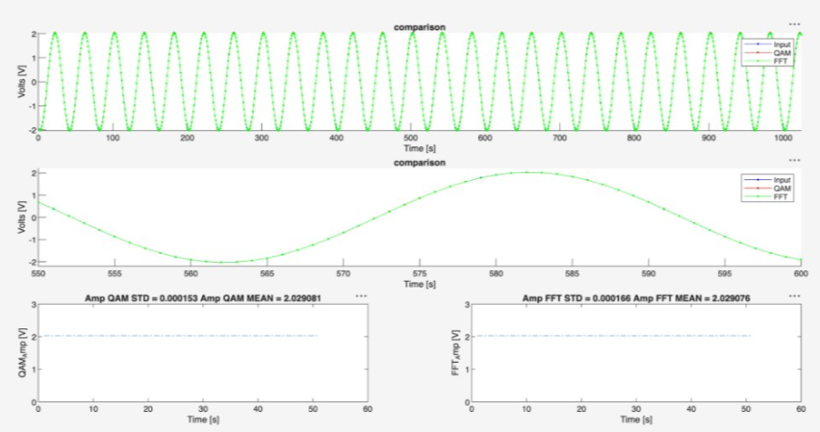

## Project1-DigitalSignalProcessing

# Introduction
This project aims to accurately estimate the parameters of a measured signal for digital signal processing. In this project, two signal analysis methods were implemented using the Analog Discovery 2, and the methods were compared with different signal conditions. The first method used was the parameter estimation method which is based on QAM(Quadrature amplitude modulation) where two orthogonal components of a signal are used to estimate the signal. The second method used the Fast Fourier Transform(FFT) to analyse the signal in the frequency domain. The goal of the project is to determine the accuracy of each method and how well the methods can estimate signal parameters in different situations testing the performance.
QAM( Quadrature amplitude modulation ) is a modulation technique that combines two modulated waves into a single wave to increase the bandwidth.For this project we are estimating signal parameters with two orthogonal components of a signal to estimate a signal.​
This method works well because it supports high data rate, noise immunity, and low error. The caveat is that if the frequency is unknown or fluctuates frequently QAM will not estimate the signal properly.
Our second method is an FFT, Fast Fourier Transform or equivalently a DFT, Discrete Fourier Transform method. This method analyzes the frequency domain of the signal to determine the important aspects of a signal such as amplitude, phase, and offset by estimating the frequency. This method supports a high speed, data compression, and noise reduction.

# Methodology
## QAM
The QAM method works to estimate each component of a sine wave using parameter estimation techniques such as the psuedo E matrix. The QAM is designed to approximation signals that are of the form:

$$
x(t) = Asin(w0t + phi) + C
$$

Utilizing the sine single identity we are able to break the equation up into parts that will be used to define the E matrix used in parameter estimation.

$$
\begin{aligned}
  sin(a + b) = sin(a)cos(b) + cos(a)sin(b) \\
  x(t) = Acos(phi)sin(w0t) + Asin(phi)cos(w0t) + C \\
\end{aligned}
$$

With this form of the equation the parts of the E matrix, p1, p2, and p3 can be defined

$$
\begin{aligned}
  p1 = Acos(phi) \\
  p2 = Asin(phi) \\
  p3 = C \\
\end{aligned}
$$

From here the E matrix is constructed as

$$
E = [p1, p2, p3]
$$

Next in order to find our signal parameters we must calculate the matrix 'p' the p matrix is how we will convert back to our A, phi, and C values

$$
p = E^-1 * signal
$$

With 'p' no defined, the parameters for the sine equation can be found using

$$
\begin{aligned}
  A = sqrt(p1^2 + p2^2) \\
  phi = tan^-1(p2/p1) \\
  C = p3\\
\end{aligned}
$$

With this the final approximated equation can be pieced back together and compared against the FFT and the measured signal from the AD2.

## FFT
The FFT or DFT is implemented using its definition, with this we are able to find the complex coefficients of the signal in the frequency domain.

$$
\begin{aligned}
  X[k] &= \sum_{n=0}^{N-1} x[n]\exp\left(-ik\Omega_0 n\right),
  \qquad k = 0,\ldots,N-1 \\
  \Omega_0 &= \frac{2\pi}{N}
\end{aligned}
$$

In order to accomplish and effective FFT analyzation we first remove any DC offset from the signal and store the value found for later use during reconstruction. Then apply the FFT using MATLAB's built in FFT function. We then scan the frequency domain for the FFT bin with he closest frequency to the value desired. The using this peak value the amplitude, and phase are calculated. 

$$
\begin{aligned}
  A = (2*S_m)/N \\
  phi = theta_m + pi/2 \\
\end{aligned}
$$

The equations are solved when $S_m$ is the peak frequency and $theta_m$ is the angle of the peak. frequency. With this the equation can be reconstructed back into the generic form of a sine wave.

## Experimental Setup
To run the experiments later described, AD2 is required to monitor the function generator on the oscilloscope and transform the measured information into a .csv file for the MATLAB code provided. For our experiments a 4Vp-p signal was generated at 125kHz, in High-Z mode, this signal was sent through the Scope Ch1. ports on the AD2. Once connected and the function generator is running, open the scope window in Waveforms to monitor the signal using the AD2. Once the signal looks as expected run the script file provided to generate the .csv files for the MATLAB program.

With the Waveforms script running, run the MATLAB file to begin the signal approximation, MATLAB will systematically read each .csv file and update the graphs of QAM, and FFT in real time. This setup was the used to conduct all testing and data collection for the comparison of the two methods

# Results
Seven tests were conducted to evaluate each method, QAM and FFT, of estimation under different signal conditions. The experiments were divided into three categories. The first category looked at the sample amount that the AD2 was reading from the inputted signal, the second category was looking at how the signal behaves when noise is added,and the final category is estimating the signal when the frequency is unknown. The baseline signal to compare the methods was a 2Vp-p(4vpp on high z) signal with 125kHz and 0 noise added at 1024 samples. The results of the test compared the changes in graphs as well as the amplitude, STD, and mean of the signals.
1. Sample Amount Test
   The first three test looked at the signal and the effects of reducing the number of samples when estimating the signal.
  Test 1: 1024 samples
The first test was a baseline test with 2Vpp,125kHz, 0% noise and 1024 samples. This parameter estimation method used the known frequencey from teh CSV file while the FFT method estimated the frequencey to build the parameters.

# Conclusion
Experimental results, including statistical comparisons of the two methods.
Discussion and interpretation of the results.
# References

