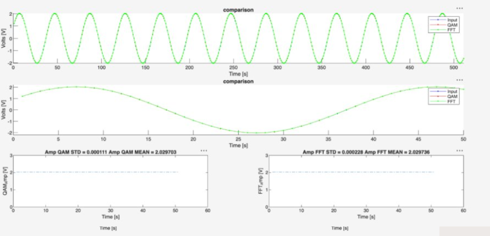
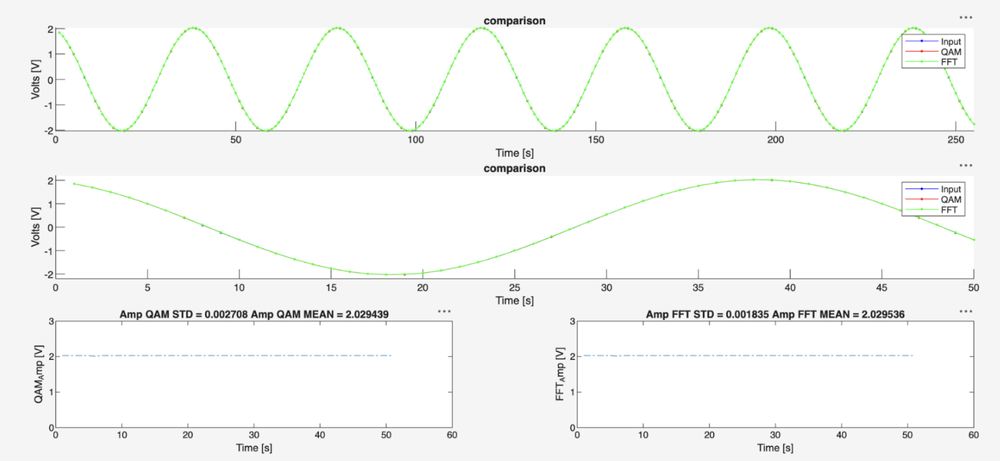
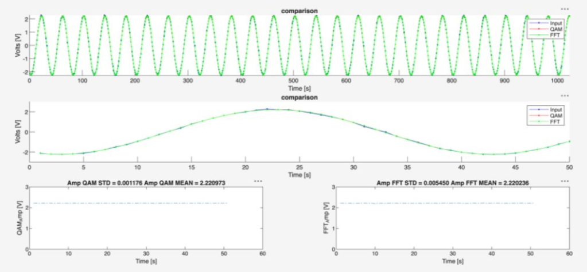
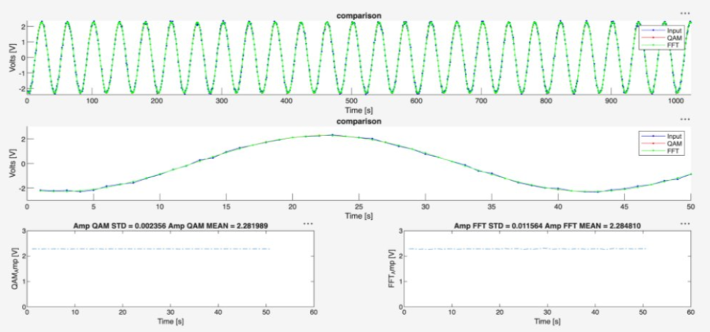
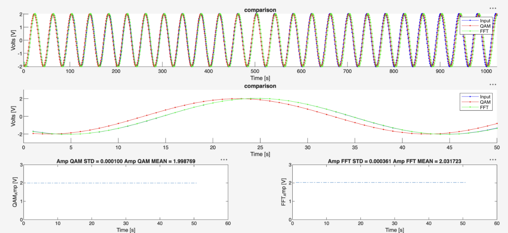
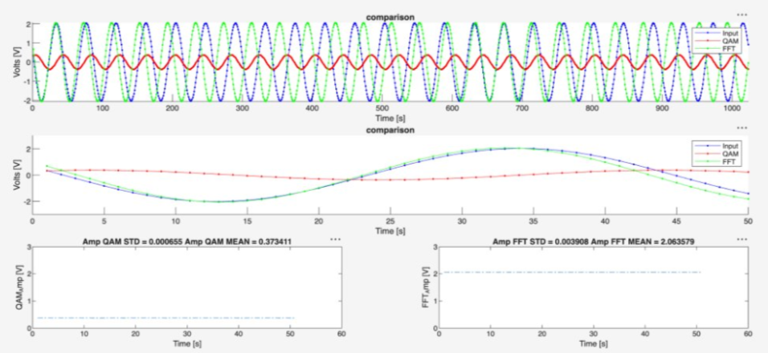
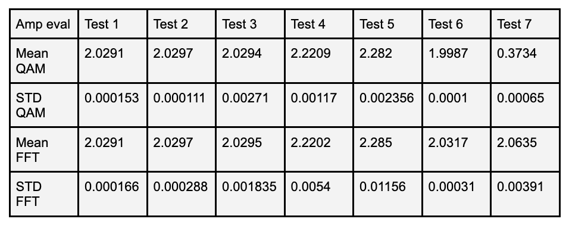

## Project1-DigitalSignalProcessing

# Introduction
This project aims to accurately estimate the parameters of a measured signal for digital signal processing. In this project, two signal analysis methods were implemented using the Analog Discovery 2, and the methods were compared with different signal conditions. The first method used was the parameter estimation method which is based on QAM(Quadrature amplitude modulation) where two orthogonal components of a signal are used to estimate the signal. The second method used the Fast Fourier Transform(FFT) to analyse the signal in the frequency domain. The goal of the project is to determine the accuracy of each method and how well the methods can estimate signal parameters in different situations testing the performance.

QAM( Quadrature amplitude modulation ) is a modulation technique that combines two modulated waves into a single wave to increase the bandwidth.For this project we are estimating signal parameters with two orthogonal components of a signal to estimate a signal.​
This method works well because it supports high data rate, noise immunity, and low error. The caveat is that if the frequency is unknown or fluctuates frequently QAM will not estimate the signal properly.

Our second method is an FFT, Fast Fourier Transform or equivalently a DFT, Discrete Fourier Transform method. This method analyzes the frequency domain of the signal to determine the important aspects of a signal such as amplitude, phase, and offset by estimating the frequency. This method supports a high speed, data compression, and noise reduction.

# Methodology
## QAM
The QAM method works to estimate each component of a sine wave using parameter estimation techniques such as the pseudo E matrix. The QAM is designed to approximation signals that are of the form:

$$
x(t) = Asin(w0t + phi) + C
$$

Utilizing the sine single identity we are able to break the equation up into parts that will be used to define the E matrix used in parameter estimation.

$$
\begin{aligned}
  sin(a + b) = sin(a)cos(b) + cos(a)sin(b) \\
  x(t) = Acos(phi)sin(w0t) + Asin(phi)cos(w0t) + C \\
\end{aligned}
$$

With this form of the equation the parts of the E matrix, p1, p2, and p3 can be defined

$$
\begin{aligned}
  p1 = Acos(phi) \\
  p2 = Asin(phi) \\
  p3 = C \\
\end{aligned}
$$

From here the E matrix is constructed as

$$
E = [p1, p2, p3]
$$

Next in order to find our signal parameters we must calculate the matrix 'p' the p matrix is how we will convert back to our A, phi, and C values

$$
p = E^-1 * signal
$$

With 'p' no defined, the parameters for the sine equation can be found using

$$
\begin{aligned}
  A = sqrt(p1^2 + p2^2) \\
  phi = tan^-1(p2/p1) \\
  C = p3\\
\end{aligned}
$$

With this the final approximated equation can be pieced back together and compared against the FFT and the measured signal from the AD2.

## FFT
The FFT or DFT is implemented using its definition, with this we are able to find the complex coefficients of the signal in the frequency domain.

$$
\begin{aligned}
  X[k] &= \sum_{n=0}^{N-1} x[n]\exp\left(-ik\Omega_0 n\right),
  \qquad k = 0,\ldots,N-1 \\
  \Omega_0 &= \frac{2\pi}{N}
\end{aligned}
$$

In order to accomplish and effective FFT analyzation we first remove any DC offset from the signal and store the value found for later use during reconstruction. Then apply the FFT using MATLAB's built in FFT function. We then scan the frequency domain for the FFT bin with he closest frequency to the value desired. The using this peak value the amplitude, and phase are calculated. 

$$
\begin{aligned}
  A = (2*S_m)/N \\
  phi = theta_m + pi/2 \\
\end{aligned}
$$

The equations are solved when $S_m$ is the peak frequency and $theta_m$ is the angle of the peak. frequency. With this the equation can be reconstructed back into the generic form of a sine wave.

## Experimental Setup
To run the experiments later described, AD2 is required to monitor the function generator on the oscilloscope and transform the measured information into a .csv file for the MATLAB code provided. For our experiments a 4Vp-p signal was generated at 125kHz, in High-Z mode, this signal was sent through the Scope Ch1. ports on the AD2. Once connected and the function generator is running, open the scope window in Waveforms to monitor the signal using the AD2. Once the signal looks as expected run the script file provided to generate the .csv files for the MATLAB program.

With the Waveforms script running, run the MATLAB file to begin the signal approximation, MATLAB will systematically read each .csv file and update the graphs of QAM, and FFT in real time. This setup was the used to conduct all testing and data collection for the comparison of the two methods

# Results
Seven tests were conducted to evaluate each method, QAM and FFT, of estimation under different signal conditions. The experiments were divided into four categories. The first category looked at the sample amount that the AD2 was reading from the inputted signal, the second category was looking at how the signal behaves when noise is added, and the third category is estimating the signal when the frequency is unknown, the final category will be analyzing the STD and mean of the amplitudes.. The baseline signal to compare the methods was a 2Vp-p(4vpp on high z) signal with 125kHz and 0 noise added at 1024 samples. The results of the test compared the changes in graphs as well as the amplitude, STD, and mean of the signals.
1. Sample Amount Test
The first three test looked at the signal and the effects of reducing the number of samples when estimating the signal.

Test 1: 1024 samples
The first test was a baseline test with 2Vpp,125kHz, 0% noise and 1024 samples. This parameter estimation method used the known frequency from the CSV file while the FFT method estimated the frequency to build the parameters.

Fig 1, the results showed that both methods were able to accurately estimate the signal.

Test 2: 512 samples
This test shows the signal estimation methods at work when the sampling rate is lower. One thing to note is that the amount of FFT bins had to be lower than half of the sampling rate we take in, at the maximum. The ideal amount of bins for this signal is 40.

Fig 2, the results show that both methods were able to accurately estimate the signal despite having less samples. 

Test 3: 256 samples
This test shows the signal estimation methods at work when the sampling rate is even lower.

Fig 3, with 256 samples the points that are plotted are able to be seen visually, despite the lower sampling rate there is no distortion in the signal estimation.

2. Noise addition test
The next two test look at the signal with increased noise, this should alter the signal estimation.

Test 4: 25% Noise
This test shows the signal estimations with 25% noise added.

Figure 4, in this image you are able to see the input wave being altered from the noise and having different amplitude in different sections. Both of the estimated signals are working very well and create a signal that follows along the estimated path.

Test 5: 50% Noise
This test shows the signal estimations with 50% noise added.

Figure 5, in this image the signals are no longer in sync with each other, too much noise has been added and the input signal is giving different values for the methods to estimate with. The QAM and FFT are creating close approximations but are out of sync at times with amplitude, phase is working well.

3. Frequency change test
The next two test look at the signal with two different frequencies. This should alter the QAM method greatly as the whole method relies on knowing the frequency beforehand, without the known frequency the QAM method falls very quickly. This means that the FFT method should be able to estimate the signal better than QAM and highlight its strengths.

Test 6: 125.5 kHz

This test shows the signal at 125.5 kHz, just a slight alteration from the original signal to view the effects.

Figure 6, in this image we are able to see the input signal the the FFT estimation are in phase for the first 600 samples but starts to get out of phase after the next 600 samples. This test shows that the QAM method starts to falter when the frequency is altered, the FFT method is working very well but still has trouble after a 600 samples.

Test 7: 11788 kHz

This test shows the signal at 11788 kHz, this is a large alteration and should make both signals estimations wrong.

Figure 7, in this image both signals are not accurately estimating the input signal anymore, this is because both signals rely on knowing something from the signal. Looking at the graph it is easy to see that the QAM method has failed entirely and was not able to estimate the signals amplitude or phase. The FFT method was able to accurately estimate the amplitude of the signal but quickly got out of phase.

4. Amplitude Mean and STD evaluation
The amplitude estimation for the QAM based method and the FFT method are shown in Table 1 bellow. The mean and standard deviation were calculated for each of the seven test and to show the accuracy  and consistency of the methods. The expected output for the voltage is 2 Vpp.

Table 1, this table shows the STD and Mean of all 7 test for the FFT and QAM based method.

For the baseline test both methods were very similar estimating an amplitude of 2.0291 V. The QAM method had a lower STD than the FFT method, 0.000153 V and 0.000166 V. This shows that the methods made very similar results only differing slightly. Tests 2 and 3 both produced similar results and showed that the sample count does not have a lot of affect on the amplitude estimations. 

The noise test, 4 and 5, shows that noise affected the amplitude estimated greatly. With 25% noise in test 4 the mean increased to 2.2209V in the FFT method, and 2.2202 for the QAM method. At 50% noise in test 5, the QAM and FFT produced means of 2.282 V and 2.285 V. this increase in the noise levels caused both methods to overestimate the amplitude by ~.2 V. The expected value is 2V. The standard deviation increased from 0.0054 to 0.01156 from test 4 to test 5. The amplitude became less stable as the noise increased.

The frequency test produced the largest differences by far. In test 6, the input frequency was changed to 125.5 kHz, this caused the QAM method to underestimate the voltage to 1.9987 V and the FFT method estimated 2.0317V. Both values remained close to 2Vpp. However, in test 7 the frequency was dropped to 117 kHz, this caused the QAM to gradually underestimate the amplitude at 0.3734 V, while the FFT method produced 2.0635V. The biggest difference in the methods was when the frequency was changed, this altered the FFT signal and caused the signal to get out of phase, but for the QAM method the signal was entirely wrong.

# Conclusion
The results of this project showed how the QAM parameter estimation method and FFT method have different results under different conditions. Under the baseline conditions, both methods produced very similar amplitude estimates and were able to accurately reconstruct the input signal. Reducing the number of samples had no effect on the overall amplitude estimation, showing that both methods were still able to estimate the signal with fewer samples.

Adding noise had a bigger effect on the amplitude estimates of both methods. As the noise increased from 25% to 50%, the estimated amplitude increased and the standard deviation also increased, this showed that the measurements became less stable. The frequency tests produced the largest difference between the two methods. The QAM method needs to know the frequency of the signal, with its amplitude estimate getting worse when the frequency was changed to 117 kHz. The FFT method was able to maintain a much closer amplitude estimate under the same condition, its reconstructed signal eventually became out of phase because the method did rely on a part of the frequency being known. To combat this in future constructions it would be better to have the frequency estimated enteirley from the set values given from the signal, and it would give a cleaner estimation if a filter and window was implimented to reduce the amount of noise

During experimentation we learned a couple of valuable lessons. Firstly we learned the importances of axis across graphs, having the different graphs with different axis's results in graphs that seem out of phase or wrong amplitudes when they are really not. We had trouble with this and removed the different axis for the input signal and for each method. Another problem was the amount of bins that we needed to estimate the signal was too high, we were getting the sampling ate from the CSV file and using it for the amount of bins. To fix this we used half or less than half of the sampling rate for the amount of bins. Another problem was plotting in MATLAB from the waveform program for the AD2 discovery, the AD2 discovery did not give the time frame from 0, this resulted in out of phase signal estimations. To fix this the time that was taken from the signal was subtracted but its first element to remove the delay.

Overall, the experiments demonstrated that both methods can provide accurate signal estimation when the signal conditions are known and relatively clean. However, the results also showed different limitations for each method. The QAM method is strongly dependent on the known frequency, while the FFT method is more capable of identifying changes in frequency but can be affected by sampling resolution, noise, and phase errors. These results demonstrate the importance of selecting a signal estimation method based on the characteristics and conditions of the signal being measured. For example, if the frequency of the signal is known, then the QAM method is able to accurately replicate the signal with different noise and sample rate, but if the frequency is unknown or the frequency fluctuates the FFT method would be optimal for estimating the signal.

# References

GeeksforGeeks. (2022). Quadrature amplitude modulation. Retrieved from https://www.geeksforgeeks.org/computer-networks/quadrature-amplitude-modulation/ ​

Lombello, C. B., & da Ana, P. A. (2023). Current trends in Biomedical Engineering. Cham, Cham: Springer International Publishing Springer. ​

